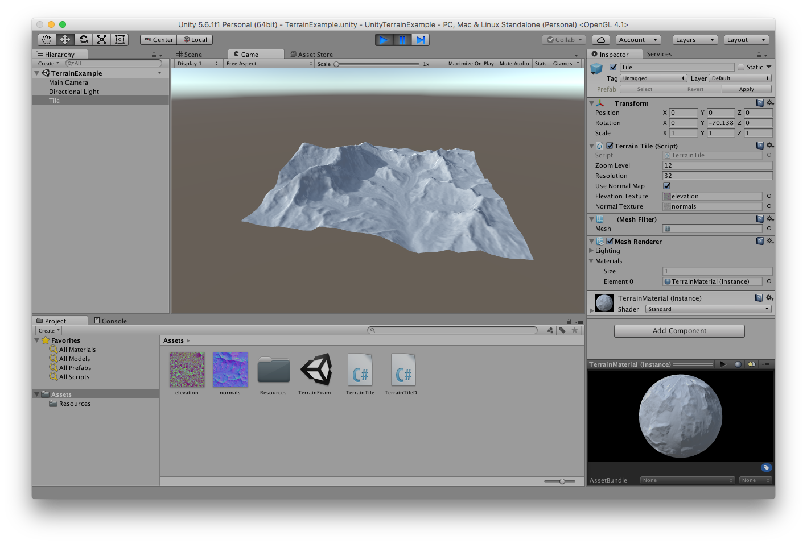

# Unity Terrain Example

This is a Unity3D project that demonstrates how to show a shaded 3D mesh using data from the [Mapzen Terrain Tile Service](https://mapzen.com/documentation/terrain-tiles/).

When you open the project in the Unity Editor, find the `TerrainExample.unity` scene in the project browser, open it, and then play the scene. Click and drag to rotate the terrain tile while the scene is playing.

The meaningful files for the demo are all in the [Assets](Assets/) folder. Below is an explanation of each of these files:

## [elevation.png](Assets/elevation.png)

This is a tile of elevation data encoded as a PNG image in the "Terrarium" format: https://mapzen.com/documentation/terrain-tiles/formats/#terrarium

This specific tile is at the tile address `11/1518/858`, and its URL from the Mapzen Terrain Service is `https://tile.mapzen.com/mapzen/terrain/v1/terrarium/11/1518/858.png?api_key=YOUR_MAPZEN_API_KEY_HERE`.

Pay close attention to the _import settings_ used for this image in the Unity Editor:
 - We need to access the data in this image from code running on the CPU (not the GPU), so the `Read/Write Enabled` option is checked.
 - Since the image is not meant to be repeated spatially, the `Wrap Mode` option is set to `Clamp`.
 - The file encodes data and not an actual image, we need to access the original pixel values from the file. Therefore, the `Filter Mode` option is set to `Point (no filter)`.
 - Again, because we need to access the original pixel values, the `Compression` option is set to `None`.

## [normals.png](Assets/normals.png)

This is a tile of terrain normal vector data encoded as a PNG image in a fairly standard "normal map" format: https://mapzen.com/documentation/terrain-tiles/formats/#normal

This specific tile is at the tile address `11/1518/858` (matching our elevation tile), and its URL from the Mapzen Terrain Service is `https://tile.mapzen.com/mapzen/terrain/v1/normal/11/1518/858.png?api_key=YOUR_MAPZEN_API_KEY_HERE`.

Mapzen's normal maps contain data in the alpha channel that encodes approximate elevation, but we don't use that here.

Again, pay attention to the _import settings_:
 - The `Texture Type` option is set to `Normal map`, enabling Unity to interpret the color values as normal vectors.
 - The image is not meant to be repeated spatially, so `Wrap Mode` option is set to `Clamp`.

## [TerrainExample.unity](Assets/TerrainExample.unity)

This file contains a Unity "Scene", essentially everything in the `Hierarchy` view on the left of the Editor.

## [TerrainMaterial.mat](Assets/TerrainMaterial.mat)

This file contains a Unity "Material" that can be applied to rendered meshes. There's not much to this Material, it's almost exactly the default Material created from the `Assets` -> `Create` -> `Material` menu option. A few settings are changed:
 - The `Albedo` option is set to a color, a light grey that I picked.
 - The `Metallic` and `Smoothness` options are turned down to zero, I just happened to prefer the way that looked.
 - The `Normal Map` option is set to the `normals.png` image.

The only important option on the Material is the `Normal Map`. We will actually set the normal map for this Material _again_ with a script in the scene, but we _must_ have a Material using a normal map in our scene in order for Unity to package the Scene correctly in a build. This is a subtle restriction that caught me off guard when I first built the demo, but it is explained in the Unity docs if you know where to look: https://docs.unity3d.com/Manual/MaterialsAccessingViaScript.html

## [TerrainTile.cs](Assets/TerrainTile.cs)

This is a C# script that we attach to a GameObject in our Unity Scene to do all the real work of creating the terrain mesh. Take a look at the comments in the file to learn how it works.

## [Tile.prefab](Assets/Tile.prefab)

This is a Unity Prefab, essentially a blueprint for creating GameObjects with a pre-configured set of components. This Prefab has three components: a Mesh Filter, a Mesh Renderer, and our Terrain Tile script.
 - The Mesh Renderer component has one entry in its `Materials` option, our `TerrainMaterial` asset.
 - The Mesh Filter component has no options set, because we generate the mesh itself at run-time.
 - The Terrain Tile script has a few options. The `Zoom Level` option should be set to the zoom level of the elevation and normal tile images. The `Resolution` option determines how many vertices will be used to build the terrain mesh. The `Use Normal Map` option sets whether the mesh lighting will use our normal map image or use approximate normal vectors generated from the vertex positions. The `Elevation Texture` and `Normal Texture` options are set to elevation.png and normals.png, respectively. Try changing `Resolution` and `Use Normal Map` while the scene is playing!
